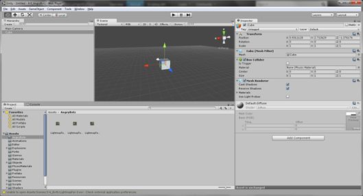

# 1.1. GameObjects


Son los diferentes elementos que se tienen en una escena, por sí solos no hacen nada y básicamente suelen contender una serie de componentes que marcan el comportamiento de los objetos. Por ejemplo para añadir un objeto a la escena se puede ir al componente de jerarquía y seleccionar createcube, de este modo se añadirá un cubo a la escena que ahora será un objeto.
El componente más común es el de transformaciones, se puede consultar en el inspector.

````{only} html
```{raw} html
<figure class="align-center">
  <picture>
    
  </picture>
  <figcaption>Figura 2.	Componentes</figcaption>
</figure>
```
````

````{only} latex
```{figure} ../../_static/images/Imagen2.png
---
name: Figura 2.	Componentes
alt: Figura 2.	Componentes
width: 85%
align: center
---
```
````

Para añadir un componente al objeto se puede hacer mediante el menú Component o mediante el botón Add Component del inspector. Por ejemplo, se puede añadir el componente para que tenga físicas el objeto seleccionado.

````{only} html
```{raw} html
<figure class="align-center">
  <picture>
    
  </picture>
  <figcaption>Figura 3.	Añadir componente</figcaption>
</figure>
```
````

````{only} latex
```{figure} ../../_static/images/Imagen3.png
---
name: Figura 3.	Añadir componente
alt: Figura 3.	Añadir componente
width: 85%
align: center
---
```
````

Ahora el componente saldrá al final en el inspector, para probar que ahora el comportamiento del cubo ha cambiado se puede pulsar en el play   y ver como el cubo tiene ahora gravedad.

````{only} html
```{raw} html
<figure class="align-center">
  <picture>
    
  </picture>
  <figcaption>Figura 4.	Componente de físicas</figcaption>
</figure>
```
````

````{only} latex
```{figure} ../../_static/images/Imagen4.png
---
name: Figura 4.	Componente de físicas
alt: Figura 4.	Componente de físicas
width: 85%
align: center
---
```
````