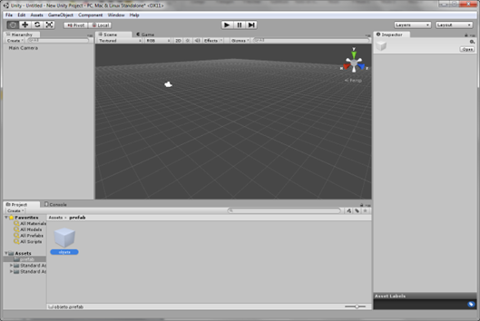

# 1.2. Prefabs

Permiten crear plantillas de game objects para crear elementos en diferentes posiciones de las escenas. Para crear las plantillas normalmente se crea un carpeta en Assets y posteriormente se añade un prefab seleccionando sobre ella con el botón derecho del ratón createprefab Figura 5. 


````{only} html
```{raw} html
<figure class="align-center">
  <picture>
    
  </picture>
  <figcaption>Figura 5. Prefab</figcaption>
</figure>
```
````

````{only} latex
```{figure} ../../_static/images/Imagen5.png
---
name: Figura 5. Prefab
alt: Figura 5. Prefab
width: 85%
align: center
---
```
````
Una vez creada la plantilla se crea el objeto según se quiera, al terminar sólo hay que arrastrar el objeto al prefab creado Figura 6. 

````{only} html
```{raw} html
<figure class="align-center">
  <picture>
    
  </picture>
  <figcaption>Figura 6.	Editando prefab</figcaption>
</figure>
```
````

````{only} latex
```{figure} ../../_static/images/Imagen6.png
---
name: Figura 6.	Editando prefab
alt: Figura 6.	Editando prefab
width: 85%
align: center
---
```
````