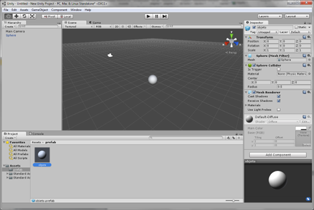

# 5. Scripts

Los scripts permiten ejecutar sentencias de código asociado a determinados objetos. Para crear un script se puede proceder de la misma manera que para los Prefab, se puede crear una carpeta en la jerarquía y añadir un script mediante la opción createjavascripts. Una vez creado al darle doble click se abre el editor MonoDevelop-Unity.


````{only} html
```{raw} html
<figure class="align-center">
  <picture>
    
  </picture>
  <figcaption>Figura 8.	Scripts</figcaption>
</figure>
```
````

````{only} latex
```{figure} ../../_static/images/Imagen8.png
---
name: Figura 8.	Scripts
alt: Figura 8.	Scripts
width: 85%
align: center
---
```
````


Para el caso de C# se podría hacer mediante el siguiente código
using UnityEngine;
using System.Collections;

public class esfera : MonoBehaviour
{

    // Use this for initialization
    void Start ()
    {
        Debug.Log("Iniciado el script");
    }
	
    // Update is called once per frame
    void Update ()
    {
        if(Input.GetKey(KeyCode.W))
        {
            Debug.Log("Muevo el objeto");
            //transform.Translate(1, 0, 0); //opción 1
            transform.position = new Vector3(transform.position.x+1, 
transform.position.y, transform.position.z); //opcion 
        }
    }
}
El paso de asociar el script con un objeto es sencillo, sólo hay que arrastrar el script hasta el objeto o insertar el componente. En caso de arrastrar automáticamente aparece ese nuevo componente y se ejecuta el código.
