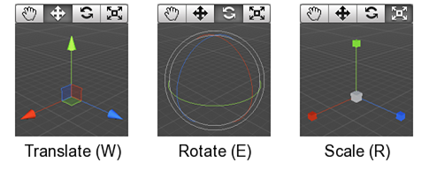

# 1.5. Transformaciones

Las transformaciones se aplican sobre los objetos seleccionados pero hay que tener en cuenta el grado de anidamiento de los objetos. Las transformaciones aplicadas en los objetos son básicamente de translación, rotación y escalado Figura 9. 


````{only} html
```{raw} html
<figure class="align-center">
  <picture>
    
  </picture>
  <figcaption>Figura 9. Transformaciones</figcaption>
</figure>
```
````

````{only} latex
```{figure} ../../_static/images/Imagen9.png
---
name: Figura 9. Transformaciones
alt: Figura 9. Transformaciones
width: 85%
align: center
---
```
````

Hay que tener en cuenta que en caso de tener objetos anidados en la jerarquía, si se aplica una transformación al nodo padre se aplican a todos los hijos, este aspecto es importante por ejemplo si se quiere hacer que una cámara siga a un personaje o para que los brazos de un personaje se muevan a  la vez que el cuerpo del mismo. Para establecer una jerarquía sólo hay que pinchar y arrastrar en el cuadro de hierarchy.


````{only} html
```{raw} html
<figure class="align-center">
  <picture>
    
  </picture>
  <figcaption>Figura 10.	Transformación nodo padre</figcaption>
</figure>
```
````

````{only} latex
```{figure} ../../_static/images/Imagen10.png
---
name: Figura 10.	Transformación nodo padre
alt: Figura 10.	Transformación nodo padre
width: 85%
align: center
---
```
````